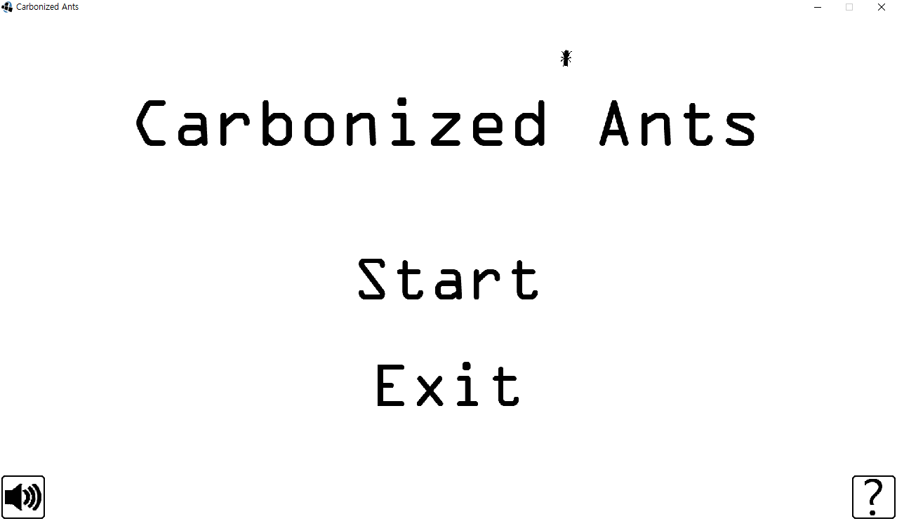
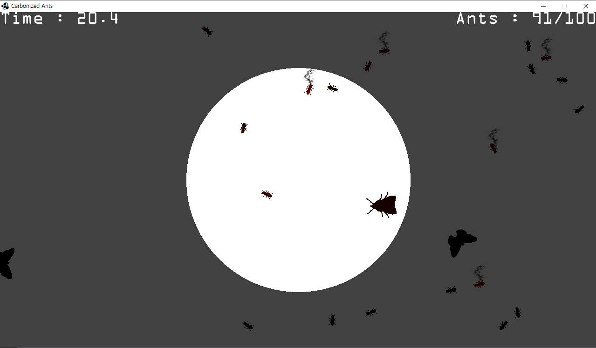
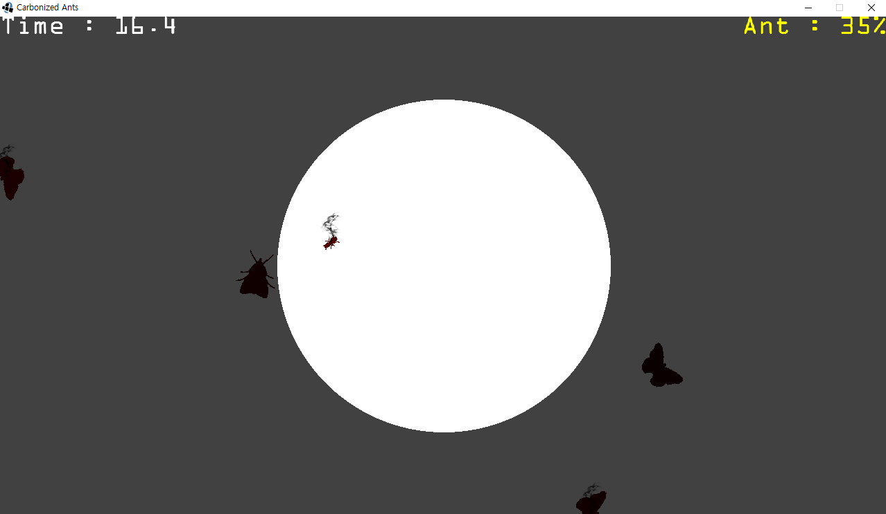

# [그룹] 개미를 탄화시키는 게임 제작 프로젝트

**진행 기간**: 2012. 10. ~ 2013. 01.

**사용 언어/기술**: Java, libGDX2

**참여 인원**: 3명

## 소개

2012~2013년도 당시 핫했던 libGDX2를 사용해보고자, 게임을 기획하고 개발했음. 옛날버전의 안드로이드와 PC를 지원함.

화면 가운데의 원을 렌즈로 삼아 개미를 비추면 빨개지다가 탄화됨.

여러마리를 탄화시키거나, 개미 외를 태우면 패널티를 먹는다든가, 보스 개미가 등장하는 등 스테이지가 여러개로 구성됨.

### 역할 및 기여

- 기획 및 스테이지 구성
- 리소스 수집/제작
- 오브젝트들의 체력이 닳는 로직 구현

## 스크린샷

게임 시작 화면

개미를 목표 개수만큼 태우는 스테이지

보스 개미를 시간 안에 태우는 스테이지

